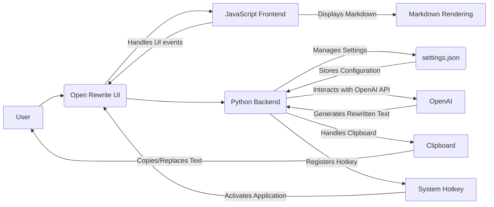

# Basic Overview:

## Open Rewrite

Open Rewrite is a desktop application designed to rewrite selected text using OpenAI's language models. It provides a user-friendly interface to quickly rephrase text in various tones and formats, or according to custom instructions.

## Tech Stack

This application is built using the following technologies:

### Frontend:
- **HTML & CSS**: For structuring and styling the user interface.
- **Tailwind CSS**: A utility-first CSS framework used for rapid UI development and consistent styling.
- **JavaScript**: For frontend logic, handling user interactions, and communicating with the Python backend.
- **marked.js**: A JavaScript library to parse and render Markdown text, used for displaying the rewritten results.

### Backend:
- **Python**: The primary programming language for the application's logic, settings management, and interaction with the OpenAI API and system functionalities.
- **pywebview**: A lightweight cross-platform wrapper that allows embedding web technologies (HTML, CSS, JavaScript) in a native desktop application. It's used to create the application window and bridge the frontend with Python.

### Large Language Model (LLM) Interaction:
- **OpenAI API**: The application leverages the OpenAI API to perform text rewriting. It uses models like gpt-4o-mini (configurable in settings) to process text based on user-selected tones, formats, or custom prompts.
- **openai Python library**: Used to interact with the OpenAI API from the Python backend.

### System Utilities:
- **pynput**: A Python library to control and monitor input devices. It's used for:
  - **Global Hotkey**: Registering a system-wide hotkey (default <alt>+r) to activate the application.
  - **Clipboard Handling**: Programmatically copying and pasting text to interact with the system clipboard.
- **pyperclip**: A cross-platform Python module for clipboard operations, simplifying text copying to the clipboard.
- **winreg**: (Windows specific) Python module to interact with the Windows Registry, used for implementing the "Launch at Startup" feature.

### Configuration & Settings:
- **JSON**: Settings are stored in a settings.json file, allowing users to configure API keys, model preferences, hotkeys, and customize rewrite tones and formats.
- **SettingsManager (Python class)**: Handles loading, saving, and managing application settings from the settings.json file.

### Package and Dependency Management:
- **Poetry**: A Python dependency management and packaging tool used to manage project dependencies, build, and package the application.
- **PyInstaller**: Used to package the Python application into a standalone executable for distribution.

### Styling and UI Components:
- **Material Icons**: Used for icons throughout the user interface, providing a consistent and recognizable visual language.

### Development Tools:
- **Tailwind CSS CLI**: Used in development to watch for changes in CSS files and rebuild the main.css stylesheet.
- **VSCode with debugpy**: Development environment configured for debugging Python code and running Tailwind CSS in watch mode.

# Future:
🔄 Explore keyring package/module to store API keys in a more secure way.

🔄 Explore platformdirs package/module to store data in different OS directories.

🔄 Store data in a sqlite database rather than JSON file.

🔄 Explore Shell extension for Windows to run the script from the right-click context menu.

✅ Fix autofocus when triggering it through shortcut key.

✅ manual result selection with user-select.

🔄 Auto Height scaling.

🔄 Markdown css needs enhancements

🔄 Replace cdn's with local.

# Extra Future:

🔄 MCP support

🔄 Streaming output.